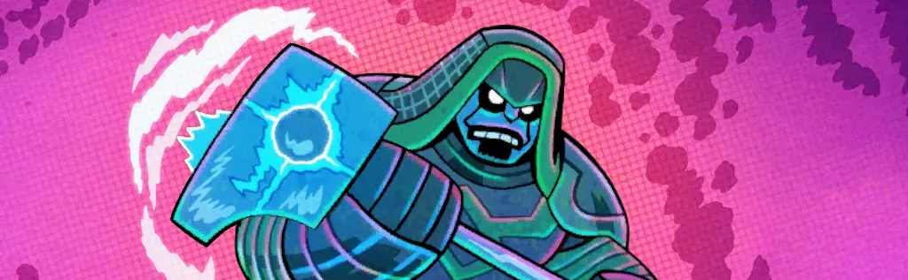

 
<div align="center"><header><h1>👽🎉 KREE PRECON PARTY 🎉👽</h1></header></div>

<div align="center"><header><h2>🏆🏆🏆 MODOK LEAGUE SEASON 3.5 🏆🏆🏆🏆</h2></header></div>  

> **One-Round of Off-Season Mayhem Between Seasons 3 & 4!**
> <br>Each kouple drafts **TWO HEROES** and uses modified precons to face the mighty **KLAW** with the deadly **Kree Fanatic** print-and-play modular set! You get **ONE SHOT** at each of six difficulty levels, but only your **HIGHEST-DIFFICULTY VICTORY** counts for points!

<div align="center"><header><h3><a href="https://modokleague.github.io/s3.5/pool/" target = "_blank">🤖 Draft-o-matic Draft Pool Generator and Simulator (link) 🤖</a></h3></header></div>
<div align="center"><header><h3><a href="https://forms.gle/VWJkNBpJg9FRDinA9" target = "_blank">📝 Submit your results (all play modes) 📝</a></h3></header></div>

## 🏆 **CHOOSE YOUR PLAY MODE**

### 🎪 CHALLENGE MODE 
```
⭐ Score as many points as you can against the challenge
🔓 Only way to participate after league registration has closed (July 3)
🤖 Choose the heroes you like or draft your heroes against the Draft-o-matic Draft Simulator
🎈 Similar benefits to league non-competitive mode
```

### ⚔️ LEAGUE COMPETITIVE MODE (CLOSED)
```
🥇 Official scoring and rankings
🎯 Maximum one attempt per difficulty
🏆 Glory and bragging rights await!t!
```

### 🎈 LEAGUE NON-COMPETITIVE MODE (CLOSED)
```
🎉 Play for fun without pressure
♾️ Unlimited attempts at each difficulty
📊 Help us gather community stats!
```

> 💡 **Pro Tip**: You can switch from Competitive to Non-Competitive mid-season if the pressure gets too intense!

## 📅 **CRITICAL DATES** 

|  | 🗓️ | ⏰|
|--------------|-------------|-------------|
| 🚫 **Registration Closes** | Thursday, July 3 | 11:59 PM PDT |
| 📊 **Draft Pool Revealed** | Friday, July 4 | Morning |
| 🚦 **Draft Begins** | Sunday, July 6 | 10:00 AM PDT |
| 🏁 **Season Ends** | Sunday, Aug 3 | 11:59 PM PDT |

> 📝 **REGISTER NOW**: Use the Season 3.5 registration channel on Discord!

## 📚 **DECK-BUILDING**

#### 📋 **Deck-Building Rules**
```
1️⃣ MUST keep at least 1 copy of each precon card
🔄 MAY replace extra copies 
➕ MAY add cards to reach 40-50 total
🎮 Standard deck-building rules apply
✨ Regular uniqueness rules during play
🚀 No collection restrictions (go wild!)
```

#### 💪 **Hulk Example**

<p align="center">
  
</p>

> ✅ **What You Can Do:**
> - Replace up to 2x **Drop Kick** or **Martial Prowess**
> - Replace up to 1x **Power of Aggression** 
> - Add cards to expand beyond 40
> 
> ⛔ **What You Can't Do:**
> - Remove unique cards like **Brawn** or **Sentry**, or remove your last copy of any card


## ⚔️ **YOUR OPPONENT: EXPERT KLAW + KREE FANATIC**

**Conditions:** The When Revealed effect on Underground Distribution (Main Scheme 1B) is changed to
> Discard cards from the encounter deck until a **non-ELITE** minion is discarded. Put that minion into play engaged with the first player.

📺  [**Get the Kree Fanatic PnP.**](https://hallofheroeslcg.com/ronan-the-accuser/) Also availaible on Hitch's Mod / TTS , OCTGN and DragnCards.

### 🏅 **DIFFICULTY LEVELS**

| ⭐ **Level** | 🂡 **Encounter Set** | 👹 **Setup: Formidable Foe Environment (Expert II)** | 👑 **Setup: Kree Supremacy¹** | 🎁 **Other Cards Added During Setup** |
|-------------|---------------------|----------------------|----------------------|-------------------|
| ☆☆☆☆☆★ | Standard II + Expert II | ✅ Expert Mode | ✅ Expert Mode | 🔊 Sonic Converter |
| ☆☆☆☆☆ | Standard 1\* + Expert 1\* (see note 2) | ✅ Expert Mode | ✅ Standard Mode | 🔊 Sonic Converter |
| ☆☆☆☆ | Standard I + Expert I | ✅ Expert Mode | ❌ None | 🔊 Sonic Converter |
| ☆☆☆ | Standard I + Expert I | ❌ None | ❌ None | ❌ None |
| ☆☆ | Standard I + Expert I | ❌ None | ❌ None | 🚀 Milano³ |
| ☆ | Standard I + Klaw I/II | ❌ None | ❌ None | 🚀 Milano³ |

> 1. Kree Supremecy Side Scheme (Galaxy's Most Wanted campaign)
> 2. Standard 1\*, Expert 1\* is from MODOK League Season 02; itemized below
> 3. The rest of the Ship Command modular is not added

### 🏆 **SCORING SYSTEM FOR COMPETITIVE PLAY**
```
🌟 Your score = Highest difficulty level defeated
🎯 Strategy: Choose your approach wisely!
   → Start high and work down?
   → Build confidence from lower levels?
   → Go for broke on medium difficulty?
```


## 🎴 SPECIAL ENCOUNTER SET FOR ☆☆☆☆☆ DIFFICULTY ONLY (Standard 1\* + Expert 1\*)

| 🃏 **Card** | 📦 **Original Set** |
|-------------|-------------------|
| ⚡ **Advance** | Standard I |
| 🖤 **Dark Dealings** | Standard II |
| 👊 **Assault** | Standard I |
| 💥 **Partial Annihilation** | Standard II* |
| 👤 **Shadows of the Past** | Standard I |
| 🤜 **Gang Up** | Standard I |
| 😵 **Caught off Guard** | Standard I |
| 🔥 **Under Fire** | Expert I |
| 💀 **Ruination** | Expert II |
| 🥊 **Slug It Out** | Expert II |
| 🎯 **Seek and Destroy** | Expert II |

> ⚠️ **Special Rule**: Partial Annihilation's Surge only triggers in alter-ego form!


## 🎮 **RULES FOR LEAGUE COMPETITIVE MODE**

### 🔧 **Preparation Phase**
```diff
+ Modify decks and practice as much as you want between attempts
! MUST declare official attempts at each difficulty before setup
```

### 🎯 **Official Attempts**
```diff
+ One shot per difficulty level
+ Choose your battles wisely
+ Score = highest difficulty conquered
```

## 📝 **THE DRAFT**

### ⚙️ **DRAFT DETAILS**

| 🎮 **Feature** | 📋 **Details** |
|----------------|----------------|
| **🦸‍♂️ Hero Pool** | All heroes through Winter Soldier & Falcon (see bans below) |
| **👥 Division Size** | Maximum 16 kouples per division |
| **📦 Pool Size** | 2 heroes/kouple + 15 extras |
| **⏱️ Pick Timer** | 24 hours per selection |
| **🤖 Auto-Pick** | Draft-bot chooses if you miss your window |
| **🐍 Draft Format** | 2 rounds, snake order (A→B→C then C→B→A) |

### 🚫 **HALL OF SHAME**

| 🦸‍♂️ **Hero** | 🎭 **Aspect** | 🚫 **Status** |
|---------------|---------------|----------------|
| 💎 **Adam Warlock** | Multi-aspect | ❌ **BANNED** |
| ⚔️ **Cable** | Leadership | ❌ **BANNED** |
| 👁️ **Cyclops** | Leadership | ❌ **BANNED** |
| 🗡️ **Gamora** | Aggression | ❌ **BANNED** |
| 🛡️ **Maria Hill** | Leadership | ❌ **BANNED** |


## 🖼️ **ALT ART AND CUSTOM CARDS**

<p align="center">
    
</p>

<p align="center">
    
</p>

<p align="center">
    
</p>

<p align="center">
    
</p>


---

<div align="center">

**💥 May the best kouple survive the Kree Precon Party challenge! 💥**

</div>
