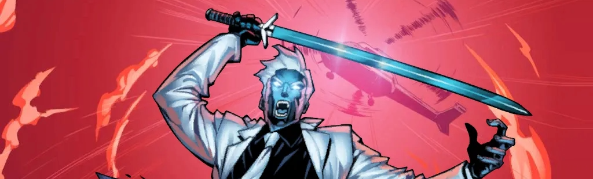

<div align="center"><header><h1>&nbsp;&nbsp;🏆🏆🏆🏆 MODOK LEAGUE SEASON 4.5 🏆🏆🏆🏆🏆</h1></header></div>  
 
<div align="center"><header><h2>⚫⚪ Mister Negative ⚪⚫&nbsp;</h2></header></div>

> **Another round of off-season mayhem**
> <br>Each kouple drafts **THREE HEROES** and and **THREE SETS OF ASPECTS** that can be added to their drafted heroes as they take on Andy N's custom Mister Negative scenario. Mister Negative is bringing along some nastiness to ruin your day, including the nefarious **Sinister Syndicate**, the devious **Iron Spider's Sinister Six**, and at higher difficulties some **Osborne Tech** he got on loan.
```
📚 no aspect restrictions
🕹️ Friendly Neighborhood mode or Gauntlet mode
```

<div align="center"><header><h3><a href="https://modokleague.github.io/s4.5/draft/" target = "_blank">🤖 S4.5 Draft-o-matic Draft Pool Generator and Simulator (link) 🤖</a></h3></header></div>
<div align="center"><header><h3>📝 Submit your results (link coming soon) 📝</a></h3></header></div>

> 📊 Submit ALL your games, kouples! Whether you're taking a loss in Friendly Neighborhood Mode, practicing your Gauntlet Mode strategy, or going for those official Gauntlet Mode points - we want it all!

## 📅 **CRITICAL DATES (2025)** 

|  | 🗓️ | ⏰|
|--------------|-------------|-------------|
| 📝 **Registration Opens** | Monday, Oct 13 | Morning |
| 🚫 **Registration Closes** | Tuesday, Oct 21 | 11:59 PM PDT |
| 📊 **Draft Pool Revealed** | Wednesday, Oct 22 | Morning |
| 🚦 **Draft Begins** | Saturday, Oct 25 | 10:00 AM PDT |
| 🏁 **Season Ends** | Wednesday, Dec 03 | 11:59 PM PDT |

> Join our [Discord server](https://discord.gg/6b4zBfchhA)

## 🏆 CHOOSE YOUR PLAY MODE

Choose between **Friendly Neighborhood Mode** for maximum flexibility where you can repeat attempts as many times as your heart desires to win at your highest possible difficulty, or jump into the intense **Gauntlet Mode** where you get ONE official shot per difficulty level to compete for the highest score against other legendary kouples! Participate in the official draft as a **registered** kouple or join the fun as an **unregistered** kouple. More details on the participation mode [page](https://modokleague.github.io/participation.html).

### 🎯 Scoring

> 🏆 In this one-round season, your score = the highest-difficulty you defeat! <br>


## ⚔️ **ROUND DETAILS: MISTER NEGATIVE**

### Expert Mister Negative + Sinister Syndicate + Iron Spider's Sinister Six + Osborne Tech as an additional deck (see below) + Standard I + Expert I (Base difficulty = ☆☆☆)

**🛠️ OSBORNE TECH DECK:** As part of setup, shuffle the Osborne Tech encounter deck and set it aside, face down. This will be known as the Osborne Tech Deck:
- The Osborne Tech Deck has its own discard pile. When an Osborne Tech card is discared, it is placed in the Osborne Tech Discard. If the Osborne Tech Deck is ever empty, shuffle the Osborne Tech Discard back into the Osborne Tech Deck.
- At the start of each Player Phase, discard all Osborne Tech cards attached to the villain and then draw the top card of the Osborne Tech Deck and attach it to the villain.
- You can remove an Osborne Tech card from the villain using its printed Hero Action, and this will cause the card to go to the Osborne Tech Discard in the same way as if it was discarded at the start of the Player Phase.

**🔄 CONDITION: Modification to Demons Unleashed 1A (Main Scheme):** Change "Each player puts an Inner Demon minion (Demon Brute or Demon Swordsmen) into play engaged with them." to "Deal an Inner Demon minion (Demon Brute or Demon Swordsmen) to each player as a face-down encounter card."

### 🏅 Difficulty Levels

| ⭐ **Level** | 🂡 **Encounter Set** | 📋 **Conditions** |
|-------------|---------------------|-----------------------------------|
| ★★★★★★ | Standard I + Expert I | ⚔️ Negative's Sword¹<br>👤 Each minion put into play gains the Self-Teamwork² trait<br>🆚 Nemesis minions³<br>☢️ Mister Negative When Revealed:  encounter cards⁴ |
| ☆☆☆☆☆ | Standard I + Expert I | ⚔️ Negative's Sword¹<br>👤 The first minion put into play each phase gains the Self-Teamwork² trait<br>🆚 Nemesis minions³<br>☢️ Mister Negative When Revealed: encounter cards⁴ |
| ☆☆☆☆ | Standard I + Expert I | ⚔️ Negative's Sword¹<br>🆚 Nemesis minions³ |
| ☆☆☆ | Standard I + Expert I |  |  |
| ☆☆ | Standard I + Expert I | 🛠️ Osborne Tech is not used |
| ☆ | Standard I + Mister Negative I/II | 🛠️ Osborne Tech is not used |

> 1. ⚔️ During setup, before resolving any **When Revealed** effects on the villain, attach Negative's Sword to the villain
> 2. **👤 Self-Teamwork (trait):** After a minion with self-teamwork enters play and engages a player, it activates against the player it is engaged with. This is in addition to other game effects that would cause this minion to activate when it enters play (such as Quickstrike).
> 3. **🆚 Condition:** Each stage of Mister Negative gains the following text: "**When Revealed:** Find and deal each player's nemesis minion to them as a face-down encounter card." Based on setup order, these cards will be dealt to each player after the initial Inner Demons, and thus will be revealed during the villain phase after these Inner Demons.
> 4. **☢️ Condition:** Each stage of Mister Negative gains the following text: "**When Revealed:** Deal 1 face-down encounter card to each player."


## 📚 **DECK-BUILDING**

📜 Standard deck-building rules apply<br>
✨ Regular uniqueness rules during play<br>
🌈 You choose each hero's aspect(s)<br>
🧬 Assign an additional set of drafted traits to each hero when you play\*<br>
🔧 Change aspects, reassign trait sets, modify your decks and practice as much as you want between official attempts and rounds, including swapping aspects between heroes

> \*Each game you will choose to play two of your drafted heroes and assign each of them an additional set of traits. Each identity must be assigned a different set of traits from among the 3 sets that you drafted. For a given set of additional traits, the additional Alter-Ego traits will apply to the Alter-Ego side of that identitry and the additional Hero traits will apply to the Hero side of that identity

## 📝 THE DRAFT

### ⚙️ Draft Details

| 🎮 **Feature** | 📋 **Details** |
|----------------|----------------|
| 📚 **Draft Groups** | 3 hero groups + 3 trait set groups |
| 📦 **Pool Size** | 2 more than needed per draft group |
| 🦸‍♂️ **Hero Pool** | All heroes through Tigra & Hulkling |
| 🚫 **Bans** | Shadowcat and SP//dr |
| 👨‍👨‍👦 **Recent Releases** | The 6 most recently-released heroes in the pool are always included in the draft groups |
| 🔒 **Pick Restrictions** | Each kouple: 1 pick per group |
| ⏱️ **Pick Timer** | 24 hours per selection |
| 🤖 **Auto-Pick** | Draft-bot chooses if you miss your window |
| 🐍 **Draft Format** | 6 rounds, snake order (A→B→C then C→B→A and so on) |

Use the Draft-o-Matic at the top of the page to generate example draft pools or simulate your own draft.
