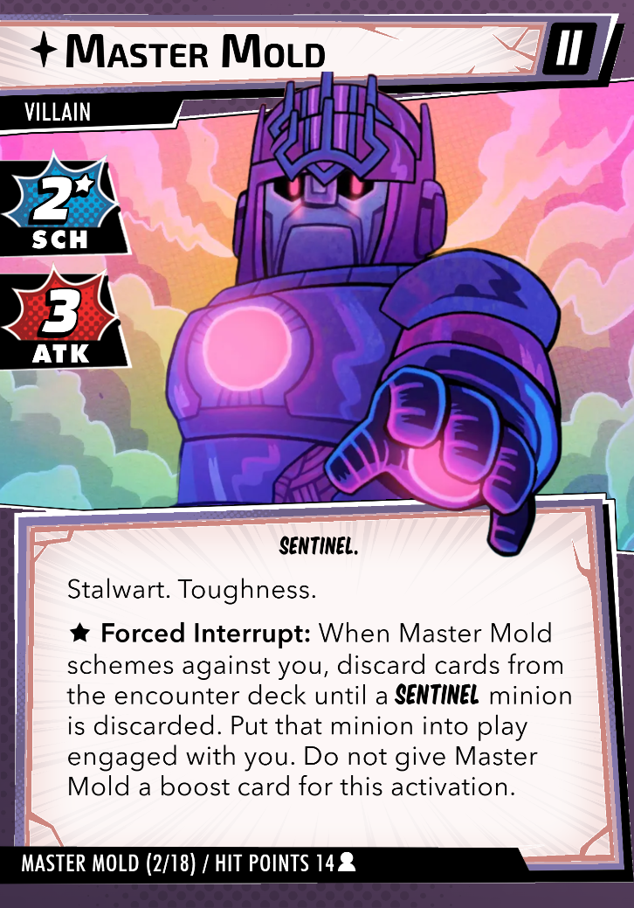
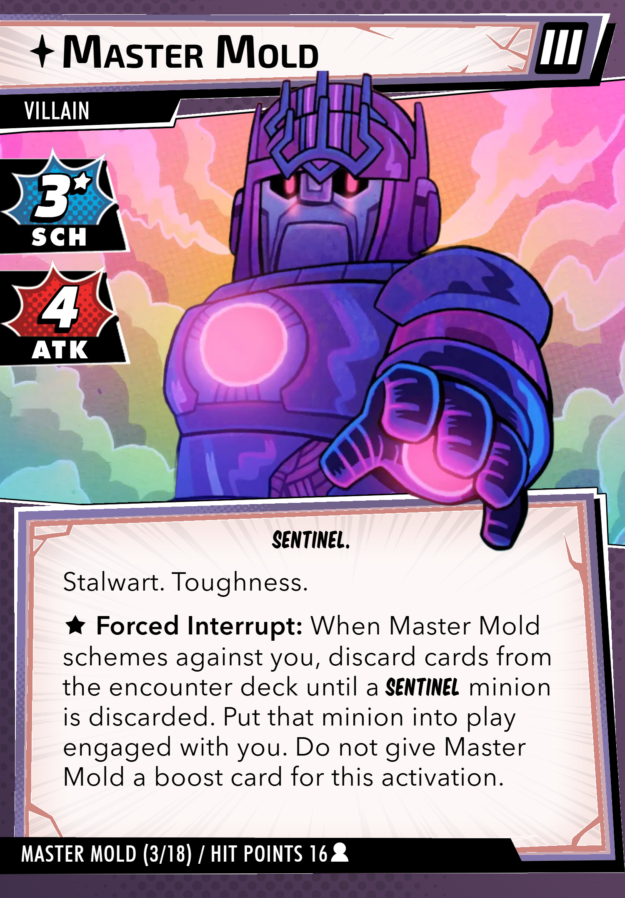
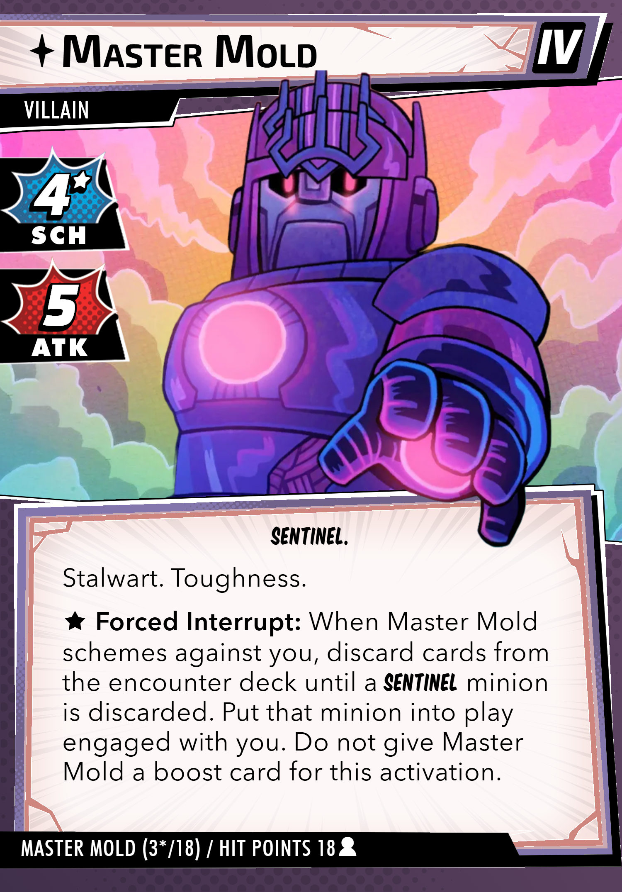
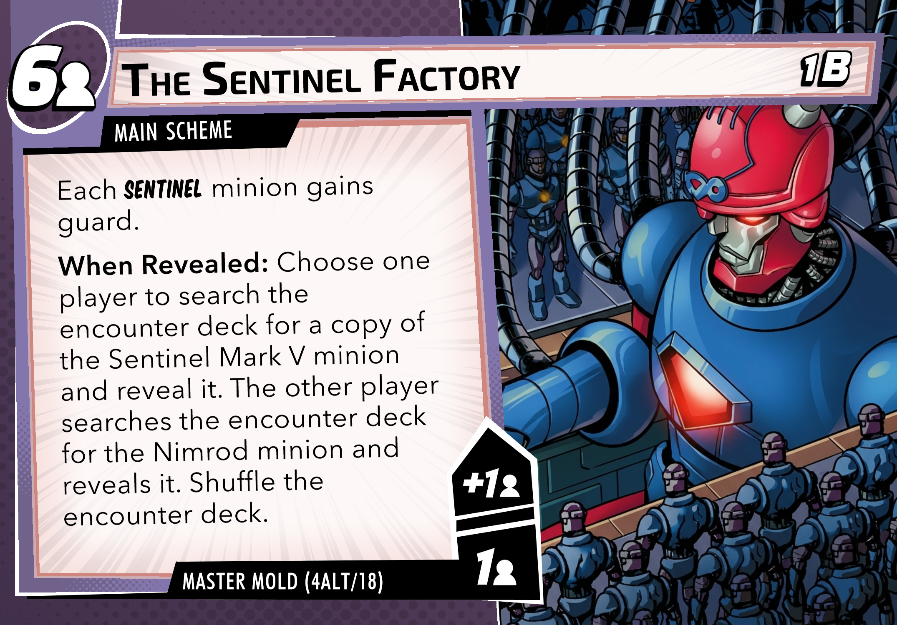
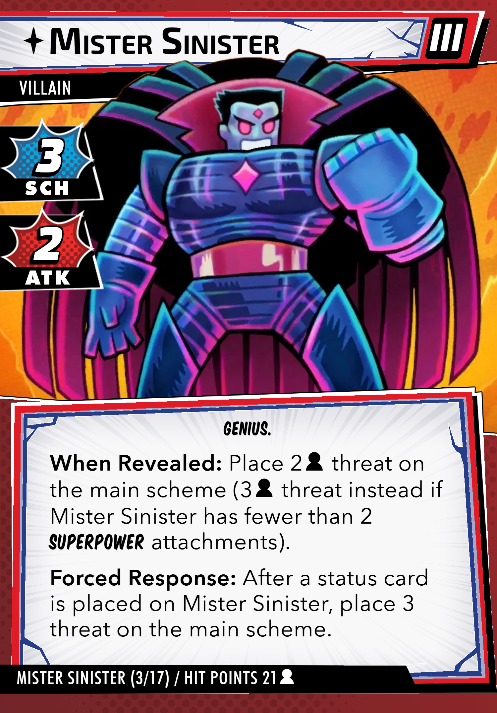
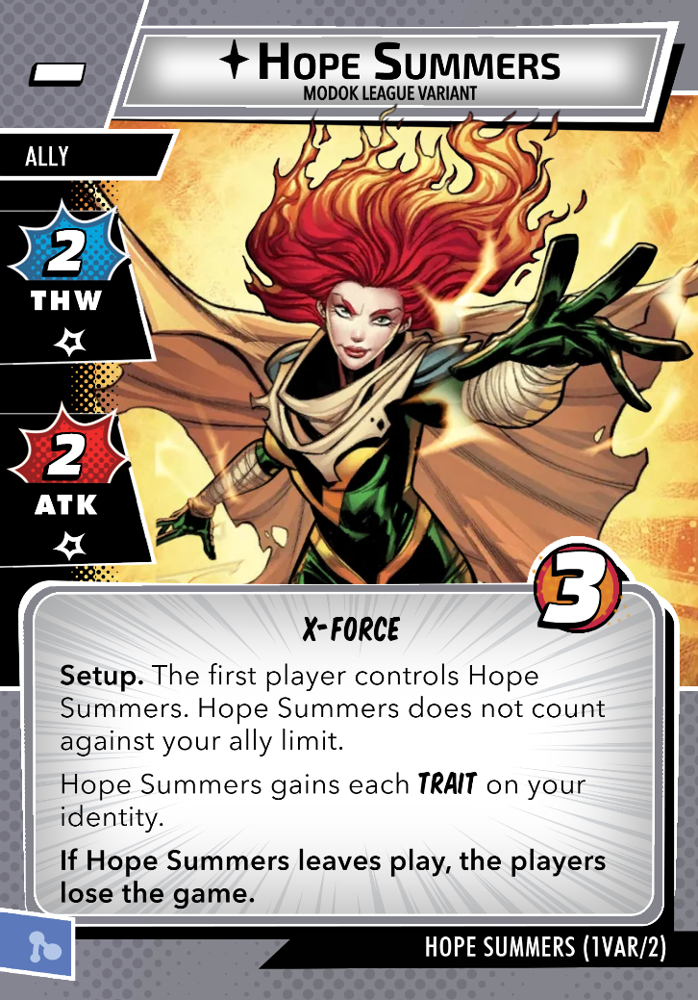

<div align="center"><header><h1>🏆🏆🏆🏆🏆 MODOK LEAGUE SEASON 05 🏆🏆🏆🏆🏆</h1></header></div>  
 
<div align="center"><header><h2>🚫❓ SOMETHING'S MISSING AGAIN ❓🚫</h2></header></div>

> 🤖😈 Face **MASTER MOLD** and **MISTER SINISTER** with crucial elements missing or modifed! 😈🤖
> <br>🔍 The regular encounter sets have gone missing!
> <br>🎭 And those pesky nemesis sets have mysteriously vanished again!

```
ODD COUPLE DRAFT: Heroes come in pre-determined pairs and so do the aspects!
👥 TWO HERO-PAIR GROUPS + 🎭 TWO ASPECT-PAIR GROUPS
```

<div align="center"><header><h3><a href="https://modokleague.github.io/s5/draft/" target = "_blank">🤖 S5 Draft-o-matic Draft Pool Generator and Simulator (link) 🤖</a></h3></header></div>

> 📊 Submit ALL your games, kouples! Whether you're taking a loss in Friendly Neighborhood Mode, practicing your Gauntlet Mode strategy, or going for those official Gauntlet Mode points - we want it all!

## 📅 **CRITICAL DATES** 

|  | 🗓️ | ⏰|
|--------------|-------------|-------------|
| 🚫 **Registration Closes** | Wednesday, March 18, 2026 | 11:59 PM PDT |
| 📊 **Draft Pool Revealed** | Thursday, March 19,2026 | Morning |
| 🚦 **Draft Begins** | Sunday, March 22, 2026 | 10:00 AM PDT |
| 🏆 **Mid-Season Awards** | Monday, May 04, 2026 | Morning |
| 🏁 **Season Ends** | Sunday, June 07, 2026 | 11:59 PM PDT |

> Join our [Discord server](https://discord.gg/6b4zBfchhA)

## 🏆 CHOOSE YOUR PLAY MODE

Choose between **Friendly Neighborhood Mode** for maximum flexibility where you can repeat attempts as many times as your heart desires to win at your highest possible difficulty, or jump into the intense **Gauntlet Mode** where you get ONE official shot per difficulty level to compete for the highest score against other legendary kouples! Participate in the official draft as a **registered** kouple or join the fun as an **unregistered** kouple. More details on the participation mode [page](https://modokleague.github.io/participation.html).

### 🎯 Scoring

> 🥊 Each round your score = the highest-difficulty you defeat! <br>
> 🏆 Your season score is just the combined score from each round.


## ⚔️ ROUND 501: MOLDY OLDIES

### Master Mold + Sentinels + Future Past + Obligations and Attachments Encounter Set + No Magneto ally (Base difficulty = 4☆)

🚫 WHAT'S MISSING: Regular encounter and nemesis sets, plus the **Magneto ally** isn't showing up at difficulties of 4☆+

_(Inspired by Con of Heroes 2023 Challenge “Mark VII My Lunch” and a challenge Kakita Jamie brought to Con of Heroes 2025)_

**CONDITION 1:** Instead of using your regular hero-specfiic nemesis sets, assign the following minions and side scheme as the heroes nemesis minions and side scheme
> 🧲 **Replacement nemesis minion 1:** Put **Magneto 2.6 (Sci-Fi)** out of play and assign it to one of the heroes as their nemesis minion
> 🌋 **Replacement nemesis minion 2:** Put **Avalanche 9.0 (Sci-Fi)** out of play and assign it to the other hero as their nemesis minion
> ☄️ **Replacement nemesis side scheme:** Put the **ICE-Teroid M side scheme (Sci-Fi)** out of play. It is considered the nemesis side scheme for both heroes

**CONDITION 2:** The **When Revelealed** text on **The Sentinel Factory (1B)** main scheme is changed to the following:
> **When Revealed:** Choose one player to search the encounter deck for a copy of the Sentinel Mark V minion and reveal it. The other player searches the encounter deck for a copy of the Nimrod mion and reveals it. Shuffle the encounter deck.

### 🏅 Difficulty Levels

| ⭐ **Level** | 🂡 **Obligations and Attachments Encounter Set¹** |  **Villain Levels** | 🧲 **Magneto Ally²** | 🛠️ **Further Modifications** |
|:-------------:|:---------------------:|:-----------------------------------:|:---------------------------------------:|:----------:|
| ★★★★★★ | ✅ | III/IV³ | 🚫 | 🚧 Nimrod's Portal + Stun Beam + Ignore Future Past Victory⁴ |
| ☆☆☆☆☆ | ✅ | II/III | 🚫 | 🚧 Nimrod's Portal + Stun Beam + Ignore Future Past Victory⁴ |
| ☆☆☆☆ | ✅ | II/III | 🚫 | |
| ☆☆☆ | ✅ | II/III | 🧲 | |
| ☆☆ | ✅ | II/III | 🧲 | 🎁 Role upgrades + Metro PD⁵ |
| ☆ | ✅ | I/II | 🧲 | 🎁 Role upgrades + Metro PD⁵ |

> 1. 🂡 The **Obligations and Attachments Encounter Set** is detailed in the next section.
> 2. 🧲 The **Magneto Ally** (Mutant Genesis 172B) is not added to the game at difficulties of 4☆+.
> 3. 🤖 Start on Master Mold III. When Master Mold III is defeated, advance to Master Mold IV (see image below). Master Mold IV is identical to Master Mold III except that it has 18 health per player, 4* Scheme and 5 Attack. As a reminder of the increased stats, slide a copy of the Inifinity Gauntlet or the Desparate side of Hope’s Captor attachment behind the villain, with the stat bonuses showing.
> 4. 🚧 Difficulty enhancements:
>    * **Condition:** Ignore the Victory keyword on all cards in the FUTURE PAST modular set, meaning they do not go to the victory display when defeated.
>    * **Setup:** After resolving the When Revealed effect on Main Scheme 1B, find a copy of the STUN BEAM attachment and attach it to the NIMROD ally.
>    * **Setup:** Find and reveal a copy of the NIMROD'S PORTAL side scheme.
> 5. 🎁 Hero benefits:
>    * **Setup:** Each player may start with any one role upgrade in play from the Mutant Genesis campaign. These role upgrades may be from the same or different roles.
>    * **Setup:** The players start with METRO P.D. support in play. This card is the back side of the FRIGHTENED POLICE side scheme (Mutant Genesis campaign card 1/5)

### 🂡 Obligations and Attachments Encounter Set 

Instead of regular Standard or Expert encounter sets, the following cards are used to make up the encounter set:

1. ANALYSIS PARALYSIS (side scheme, Whispers of Paranoia)
2. CITIZEN V'S SWORD (attachemnt, Thunderbolts) - Any text referring to Citizen V instead refers to "the villain"
3. HIGH-TECH ARMAMENT (attachement, Winter Soldier Nemesis)
4. HUNTED (obligation, Distopian Nightmare)
5. LIFE DRAIN (attachment, Sauron)
6. OLD GRUDGE (attachment, Whispers of Paranoia)
7. PAPARAZZI (obligation, Mojo)
8. PAST MACHINATIONS (treachery, Kang)
9. TABULA RASA (attachment, Deadpool Nemesis)
10. SUPERHUMAN STRENGTH (attachment, She-Hulk Leader)

### Modified and alt-art cards
&nbsp;&nbsp;
<p></p>

## ⚔️ ROUND 502: SOUPED-UP SINISTER

### Mister Sinister +  Flight/Telepathy/Super Strength + Armadillo + Sauron + Hope Summers + Treacherous Encounter Set (Base difficulty = 4☆)

🚫 WHAT'S MISSING: Regular encounter and nemesis sets + the Hope Summers ally as it appears in the Hope Summer modular set

_(Inspired by the Gene Hack Man Con of Heroes 2024 Challenge)_

**CONDITION 1:** Instead of using your regular hero-specfiic nemesis sets, assign SAURON to one hero as their nemesis minion and ARMADILLO to the other hero. These minions are included in the encounter deck built for this scenario and are not set aside like regular nemesis minions are. There are no nemesis side schemes for this scenario.

**CONDITION 2:** Replace the HOPE SUMMERS ally from the Home Summers modular set with a modified version of the basic HOPE SUMMERS ally used in deck building. This copy of HOPE SUMMERS gains the text "Setup. The first player controls Hope Summers. Hope Summers does not count against your ally limit. If Hope Summers leaves play, the players lose the game." Additionally, change the card cost to "-". See below for a modified version of this card. 


### 🏅 Difficulty Levels

| ⭐ **Level** | 🂡 **Treacherous Encounter Set¹** |  **Villain Levels** | 🛠️ **Further Modifications** |
|:-------------:|:------------:|:------------:|:-------------:|
| ★★★★★★ | ✅ | III/IV² | 📎Additional attachment³<br>🚧 Teleported Away + Armadillo + Sauron⁴ |
| ☆☆☆☆☆ | ✅ | II/III | 📎Additional attachment³<br>🚧 Teleported Away + Armadillo + Sauron⁴ |
| ☆☆☆☆ | ✅ | II/III |  📎Additional attachment³ |
| ☆☆☆ | ✅ | II/III |  |
| ☆☆ | ✅ | II/III | 🎁 Next Evolution Campaign Environments⁵ |
| ☆ | ✅ | I/II | 🎁 Next Evolution Campaign Environments⁵ |

> 1. 🂡 The **Treacherous Encounter Set** is detailed in the next section.
> 2. ♦️ Start on Mister Sinister III. When Mister Sinister III is defeated, advance to Mister Sinister IV (see image below). Mister Sinister IV is identical to Master Mold III except that he has 25 health per player, 4 Scheme and 3 Attack. As a reminder of the increased stats, slide a copy of the Inifinity Gauntlet or the Desparate side of Hope’s Captor attachment behind the villain, with the stat bonuses showing.
> 3. 📎 **Condition:** When you complete Main scheme 1B, resolve the When Revealed ability of the Stage 2 main scheme you are removing from the game before advancing to the random stage 2A. 
> 4. 🚧 **Setup:** Put the TELEPORTED AWAY side scheme into play. Put the ARMADILLO minion into play, engaged with one of the players. Put the SAURON minion into play engaged with the other player.
> 5. 🎁 The players start the game with two of the Next Evolution Campaign Environments in play (Team Assembled, Safehouse Established, Geared Up, Mission Prepped, Practiced Maneurvers and Prepared Defenses). You do not need to include the associated campaign minion or side scheme with any of these environments. 

### 🂡 Treacherous Encounter Set 

Instead of regular Standard or Expert encounter sets, the following cards are used to make up the encounter set:

1. COVERT OPS (treachery, Black Widow) - Any text referring to Black Widow instead refers to "the villain"
2. DEAD TO RIGHTS (treachery, Badoon Headhunter)
3. INFINITE POWER (treachery, Red Skull) - Any text referring to Red Skull instead refers to "the villain"
4. NO PLACE FOR THE LIVING (treachery, Legions of Hel)
5. POWER AND DECADENCE (treachery, Hellfire)
6. SMEAR CAMPAIGN (treachery, Sinister Motives Campaign Bad Publicity)
7. SPREADING LIES (treachery, Red Skull) - Any text referring to Red Skull instead refers to "the villain"
8. SUMMONED BACK (treachery, Mad Titan's Shadow Campaign)
9. SWINGING ASSAULT (treachery, Symbiotic Strength)

### Modified and alt-art cards
&nbsp;&nbsp;
<p></p>


## 📚 **DECK-BUILDING**

🩷 You can swap out any drafted aspect for 'Pool<br>
📜 Standard deck-building rules apply<br>
✨ Regular uniqueness rules during play<br>
🔧 Modify decks and practice as much as you want between official attempts and rounds, including swapping aspects between heroes

## 📝 THE DRAFT

### ⚙️ Draft Details

| 🎮 **Feature** | 📋 **Details** |
|----------------|----------------|
| 👥 **Division Size** | Maximum 12 kouples per division |
| 📚 **Draft Groups** | 2 hero-pair groups + 2 aspect-pair groups |
| 📦 **Pool Size** | 3 more than needed per draft group |
| 🦸‍♂️ **Hero Pool** | Hero pairs, partnering stronger heroes with weaker hereos. <br>All heroes through Wonder Man & Hercules (no bans) |
| 🌈 **Aspect Pool** | Aspect pairs, with two-of-a-kind less likely |
| 🚫 **Pick Restrictions** | 1 pick per draft group |
| ⏱️ **Pick Timer** | 24 hours per selection |
| 🤖 **Auto-Pick** | Draft-bot chooses if you miss your window |
| 🐍 **Draft Format** | 4 rounds, snake order (A→B→C then C→B→A) |

**Further draft notes:**
> * **Spider-Woman:** If Spider-Woman is added to the pool, she will have a pre-selected aspect that you must use, and then her other aspect will be whichever of your drafted aspects that you assign to her.<br>
> * **Adam Warlock:** If you draft Adam Warlock, the aspect that you assign to him must be one of the four aspects that you use to build his deck.

Use the Draft-o-Matic at the top of the page to generate example draft pools or even simulate your own draft.

## 💚🥊 SHE-HULK'S PUNCH CLUB 🥊💚

📢 Compete for bragging rights with your off-picks

> After you earn your top score in a round, take your unused hero pair and aspect pair from that round and try to top the Punch Club leaderboard following Friendly Neighborhood Mode scoring rules. Uses the regular score submission form.

